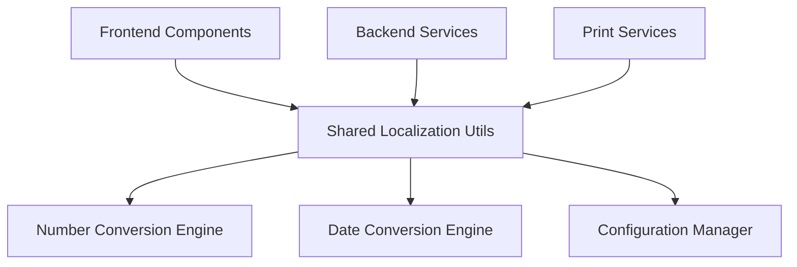

# Design Document - Thai Number Localization

## Overview

This design implements a comprehensive Thai number localization system for the MuniCollect application. The system provides Buddhist Era (B.E.) year conversion, maintains Arabic numerals for frontend display, and converts to Thai numerals specifically for printed output. The solution is built as a shared utility library with frontend React components and backend Go services.

## Architecture

The localization system follows a layered architecture:



### Core Components

1. **Shared Localization Library** (`@municollect/shared`)
   - Number conversion utilities (Arabic ↔ Thai numerals)
   - Date conversion utilities (Gregorian ↔ Buddhist Era)
   - Configuration management
   - Type definitions and validation schemas

2. **Frontend Integration** (Next.js/React)
   - React hooks for localized number display
   - Date formatting components
   - Configuration UI components

3. **Backend Integration** (Go)
   - API endpoints for configuration management
   - Print service integration
   - Database utilities for date handling

4. **Print Service Layer**
   - Print template processors
   - Number format converters for receipts
   - Printer-specific formatting

## Components and Interfaces

### Shared Library Components

#### Number Conversion Engine
```typescript
interface NumberConverter {
  toThaiNumerals(input: string | number): string;
  toArabicNumerals(input: string): string;
  formatCurrency(amount: number, locale: 'thai' | 'arabic'): string;
}
```

#### Date Conversion Engine
```typescript
interface DateConverter {
  toBuddhistEra(gregorianYear: number): number;
  toGregorian(buddhistYear: number): number;
  formatDate(date: Date, options: DateFormatOptions): string;
}

interface DateFormatOptions {
  era: 'buddhist' | 'gregorian';
  numerals: 'thai' | 'arabic';
  includeEraPrefix: boolean;
}
```

#### Configuration Manager
```typescript
interface LocalizationConfig {
  enableBuddhistEra: boolean;
  enableThaiNumeralsForPrint: boolean;
  defaultDateFormat: DateFormatOptions;
  printerSettings: PrinterLocalizationSettings;
}

interface PrinterLocalizationSettings {
  useThaiNumerals: boolean;
  includeBuddhistEra: boolean;
  currencyFormat: 'thai' | 'international';
}
```

### Frontend Components

#### React Hooks
```typescript
// Custom hooks for localized display
const useLocalizedNumber = (value: number) => string;
const useLocalizedDate = (date: Date, options?: DateFormatOptions) => string;
const useLocalizationConfig = () => LocalizationConfig;
```

#### React Components
```typescript
// Display components
<LocalizedNumber value={1234} />
<LocalizedDate date={new Date()} showEra={true} />
<LocalizedCurrency amount={1500.50} />

// Configuration components
<LocalizationSettings />
<PrinterSettings />
```

### Backend Services

#### Go Service Interfaces
```go
type LocalizationService interface {
    ConvertToThaiNumerals(input string) string
    ConvertToBuddhistEra(year int) int
    GetConfig() LocalizationConfig
    UpdateConfig(config LocalizationConfig) error
}

type PrintService interface {
    FormatForPrint(data PrintData) string
    ApplyThaiLocalization(content string) string
}
```

## Data Models

### Configuration Schema
```typescript
const LocalizationConfigSchema = z.object({
  enableBuddhistEra: z.boolean().default(true),
  enableThaiNumeralsForPrint: z.boolean().default(true),
  defaultDateFormat: z.object({
    era: z.enum(['buddhist', 'gregorian']).default('buddhist'),
    numerals: z.enum(['thai', 'arabic']).default('arabic'),
    includeEraPrefix: z.boolean().default(true)
  }),
  printerSettings: z.object({
    useThaiNumerals: z.boolean().default(true),
    includeBuddhistEra: z.boolean().default(true),
    currencyFormat: z.enum(['thai', 'international']).default('thai')
  })
});
```

### Print Data Models
```typescript
interface PrintableDocument {
  id: string;
  date: Date;
  items: PrintableItem[];
  totalAmount: number;
  customerInfo?: CustomerInfo;
}

interface PrintableItem {
  name: string;
  quantity: number;
  unitPrice: number;
  totalPrice: number;
}
```

## Error Handling

### Error Types
```typescript
enum LocalizationErrorType {
  INVALID_NUMBER_FORMAT = 'INVALID_NUMBER_FORMAT',
  INVALID_DATE_FORMAT = 'INVALID_DATE_FORMAT',
  CONFIG_LOAD_ERROR = 'CONFIG_LOAD_ERROR',
  PRINTER_FORMAT_ERROR = 'PRINTER_FORMAT_ERROR'
}

class LocalizationError extends Error {
  constructor(
    public type: LocalizationErrorType,
    message: string,
    public originalValue?: any
  ) {
    super(message);
  }
}
```

### Error Handling Strategy
1. **Graceful Degradation**: If Thai numeral conversion fails, fall back to Arabic numerals
2. **Validation**: Validate all inputs before conversion
3. **Logging**: Log conversion errors for debugging
4. **User Feedback**: Provide clear error messages in configuration UI

## Testing Strategy

### Unit Testing
- **Number Conversion**: Test all Arabic to Thai numeral conversions
- **Date Conversion**: Test Gregorian to Buddhist Era calculations
- **Edge Cases**: Test with invalid inputs, boundary values, and special characters
- **Configuration**: Test config validation and default values

### Integration Testing
- **Frontend Integration**: Test React components with various localization settings
- **Backend Integration**: Test API endpoints and database operations
- **Print Integration**: Test print formatting with different printer types

### End-to-End Testing
- **User Workflows**: Test complete user journeys from configuration to printing
- **Cross-Platform**: Test on different browsers and printer types
- **Localization Scenarios**: Test switching between different localization settings

### Test Data
```typescript
const testCases = {
  numbers: [
    { arabic: '123', thai: '๑๒๓' },
    { arabic: '0', thai: '๐' },
    { arabic: '2024', thai: '๒๐๒๔' }
  ],
  dates: [
    { gregorian: 2024, buddhist: 2567 },
    { gregorian: 1900, buddhist: 2443 }
  ],
  currency: [
    { amount: 1234.50, thai: '๑,๒๓๔.๕๐ บาท', arabic: '1,234.50 บาท' }
  ]
};
```

## Implementation Phases

### Phase 1: Core Utilities
- Implement number conversion functions
- Implement date conversion functions
- Create configuration schema and validation
- Set up shared package structure

### Phase 2: Frontend Integration
- Create React hooks and components
- Implement configuration UI
- Add localization to existing components
- Update date displays throughout the app

### Phase 3: Backend Integration
- Implement Go service layer
- Create configuration API endpoints
- Update database date handling
- Add localization middleware

### Phase 4: Print Integration
- Implement print template processors
- Add Thai numeral conversion for receipts
- Test with different printer types
- Optimize for portable printers

### Phase 5: Testing & Optimization
- Comprehensive testing suite
- Performance optimization
- Documentation and examples
- Production deployment